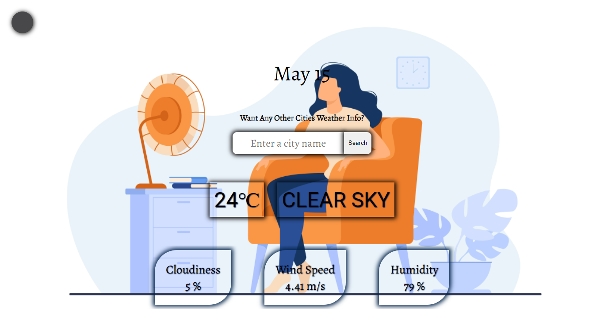
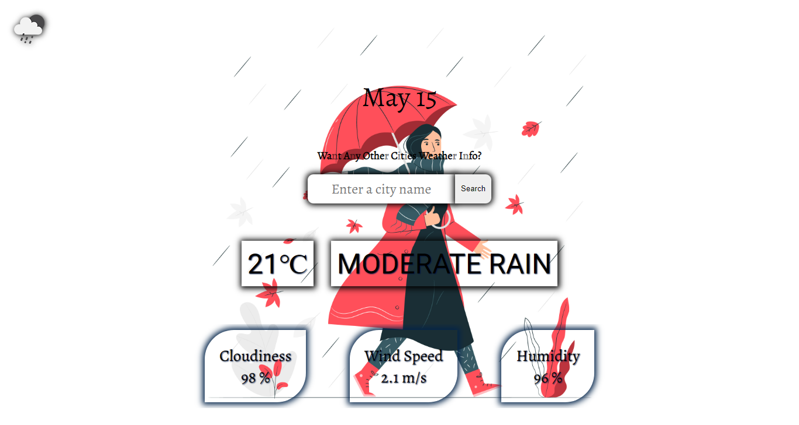

# Weather-App
A Weather App made using [Open Weather API](https://openweathermap.org/) and HTML5 Geolocation API

## Technologies
Build with:
* HTML5
* CSS3
* Javascript  

## Features 
* User can view the weather in his/her current location.
* Users can also search for current weather in various cities around the world!
* Users can also view other details such as wind speed, humidity, and cloudiness.
* Background image will change depending on weather conditions.
* Weather icon will change depending on weather conditions as well as day/night.

## Roadmap
* Toggle the temperature unit (Celsius / Fahrenheit).
* Alert for certain user-specified weather conditions.
* Daily weather notification at a certain time interval.

## Preview

